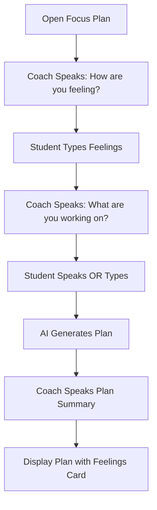
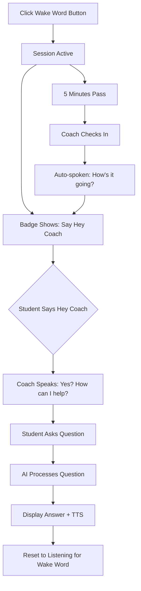

# Interactive Voice Features - Implementation Summary

**Date:** November 12, 2025  
**Status:** ✅ **IMPLEMENTED**

---

## 🎯 Overview

We've transformed the Focus Plan and Educational Assistant into highly interactive, voice-first experiences with:
- **Wake word activation** ("Hey Coach")
- **Continuous listening** throughout the session
- **5-minute check-ins** from the coach
- **Natural conversation flow** with text-to-speech

---

## 🎤 Features Implemented

### 1. Focus Plan - Conversational Planning

**Location:** `src/components/homework-planner.tsx`

#### Flow:
1. **Greeting Stage** 🤝
   - Coach speaks: "Hey there! I'm your learning coach..."
   - Student types/speaks how they're feeling
   - Emotional check-in to understand student state

2. **Question Stage** 📝
   - Coach asks: "What are you working on today?"
   - **Two input modes:**
     - ✍️ **Type It:** Text input
     - 🎤 **Say It:** Voice-to-text (browser-based or premium)
   - Continuous voice input supported

3. **Plan Generation** ✨
   - Directly creates personalized focus plan
   - Coach speaks the summary aloud
   - Shows student's emotional state alongside tasks

#### Key Features:
- **Text-to-Speech:** Coach speaks at each stage
- **Silent fallback:** If TTS fails, continues without audio
- **Voice-first design:** Encourages natural conversation
- **Emotional context:** Uses feelings to personalize plan

---

### 2. Educational Assistant - Wake Word Activation

**Location:** `src/components/educational-assistant-chat.tsx`

#### Wake Word System:
- **Activation phrase:** "Hey Coach"
- **Always listening:** When session is active
- **Variations detected:**
  - "hey coach"
  - "coach"
  - "heycoach"

#### Check-In System:
- **Frequency:** Every 5 minutes
- **Random messages:**
  - "Hey, just checking in! How's it going with your work?"
  - "Quick check — do you need help with anything?"
  - "I'm here if you need me! How's your focus?"
  - "Time for a quick breather — how are you doing?"
- **Auto-spoken:** Uses TTS to speak check-ins

#### UI Indicators:
1. **Live Session Button**
   - Shows "Wake Word" when inactive
   - Shows "Live Session" (pulsing) when active
   - Click to start/stop

2. **Status Badge**
   - "Say 'Hey Coach'" - waiting for wake word
   - "Listening..." - capturing your question

3. **Timer Badge**
   - Shows "Next check-in: Xmin"
   - Counts down from 5 minutes

---

## 🔧 Technical Implementation

### Custom Hook: `use-coach-voice-session.ts`

**Location:** `src/hooks/use-coach-voice-session.ts`

#### Features:
- **Continuous speech recognition** using `react-speech-recognition`
- **Wake word detection** with fuzzy matching
- **Periodic check-ins** with configurable interval
- **Session management** (start/stop/reset)
- **Transcript capture** for commands

#### API:
```typescript
const {
  isSessionActive,       // Is session running?
  isListeningForWakeWord, // Waiting for "Hey Coach"
  isListeningForCommand,  // Capturing your question
  transcript,            // Current transcript
  listening,             // Is mic active?
  lastCheckInTime,       // When was last check-in
  startSession,          // Start wake word session
  stopSession,           // Stop everything
  resetToWakeWord,       // Reset after command processed
  resetTranscript,       // Clear transcript
  browserSupportsSpeechRecognition, // Is browser compatible?
} = useCoachVoiceSession({
  wakeWord: 'hey coach',
  checkInInterval: 5, // minutes
  onWakeWordDetected: () => {...},
  onCheckIn: () => {...},
  onTranscript: (text) => {...},
});
```

---

## 🎨 User Experience Flow

### Scenario 1: Using Focus Plan



### Scenario 2: Using Wake Word Session



---

## 🎯 Design Principles Followed

### 1. **Empowerment Over Answers**
- Coach checks in on feelings first
- Encourages self-reflection
- Supportive, not directive

### 2. **Calm & Accessible**
- Silent fallback if TTS fails
- Clear visual indicators (badges, animations)
- No forced interactions

### 3. **Warm & Curious Tone**
- "Hey there!" vs "Hello"
- "Let's..." vs "You must..."
- "How are you feeling?" vs "What's your problem?"

### 4. **Confidence Before Grades**
- Emotional check-in before task planning
- "You're building great habits" in check-ins
- Focus on progress, not perfection

---

## 📱 Browser Compatibility

### Speech Recognition (Wake Word):
- ✅ **Chrome** - Full support
- ✅ **Edge** - Full support
- ⚠️ **Safari** - Limited support (iOS 14.5+)
- ❌ **Firefox** - Not supported

### Fallback Strategy:
If browser doesn't support speech recognition:
- Wake word button disabled
- Alert shown: "Your browser does not support speech recognition"
- Text input still available

---

## 🧪 Testing Checklist

### Focus Plan:
- [ ] Coach speaks greeting on load
- [ ] Can type feelings and continue
- [ ] Can skip emotional check-in
- [ ] Coach speaks question after continue
- [ ] Voice input captures transcript
- [ ] Text input works as alternative
- [ ] Plan generates from combined input
- [ ] Coach speaks plan summary
- [ ] Feelings card displays correctly
- [ ] "Make a New Plan" resets everything

### Wake Word Session:
- [ ] "Wake Word" button starts session
- [ ] Badge shows "Say 'Hey Coach'"
- [ ] Saying "Hey Coach" triggers response
- [ ] Coach speaks "Yes? How can I help?"
- [ ] Question captured and processed
- [ ] Resets to wake word after answer
- [ ] Check-in fires after 5 minutes
- [ ] Check-in message is random
- [ ] Check-in is auto-spoken
- [ ] Timer badge counts down correctly
- [ ] "Stop Session" ends everything

---

## 🚀 Future Enhancements

### Potential Additions:
1. **Custom wake words** - Let students choose ("Hey Buddy", "Coach")
2. **Language support** - Multi-language wake words
3. **Interrupt detection** - "Stop" or "Cancel" to interrupt coach
4. **Proactive suggestions** - "Want to take a quick quiz?"
5. **Focus mode timer** - Pomodoro-style work sessions
6. **Parent controls** - Set check-in frequency
7. **Voice profiles** - Remember student preferences

---

## 🔗 Related Files

### Core Components:
- `src/components/homework-planner.tsx` - Focus Plan with TTS
- `src/components/educational-assistant-chat.tsx` - Wake word integration
- `src/hooks/use-coach-voice-session.ts` - Wake word & check-in logic

### Supporting:
- `src/components/voice-to-text-premium.tsx` - Voice input UI
- `src/app/api/tts/route.ts` - Text-to-speech API
- `src/components/ui/badge.tsx` - Status indicators

---

## 💡 Usage Tips

### For Students:
1. **Start a wake word session** - Click "Wake Word" button
2. **Keep working** - Coach will check in every 5 minutes
3. **Say "Hey Coach"** anytime you need help
4. **Ask naturally** - No need for perfect phrasing

### For Developers:
1. **Test with microphone** - Required for wake word
2. **Check console logs** - Shows wake word detection
3. **Monitor TTS failures** - Falls back silently
4. **Adjust check-in interval** - Change `checkInInterval` prop

---

## 📊 Success Metrics

### Engagement:
- **Wake word activations** per session
- **Check-in responses** (vs ignored)
- **Voice input usage** (vs text)

### Student Experience:
- **Completion rate** of focus plans
- **Time spent** in wake word sessions
- **Return rate** for subsequent sessions

---

**Status:** ✅ **Ready for Testing!**

The interactive voice features are fully implemented. Students can now have natural, continuous conversations with their learning coach, with automatic check-ins to maintain engagement and support.

