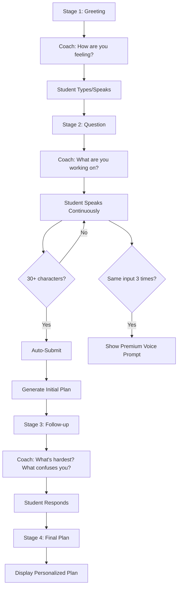

# Voice UX Improvements - Focus Plan

**Date:** November 12, 2025  
**Status:** ✅ **IMPLEMENTED**

---

## 🎯 **What Was Fixed**

### **Before (Old Flow):** ❌
1. Student clicks "Start Recording"
2. Speaks into microphone
3. Clicks "Stop Recording"
4. Clicks "Make My Focus Plan"
5. Premium voice prompt always visible
6. No follow-up questions

**Problems:**
- Too many manual steps
- Friction in the conversation
- Premium prompt spammy
- One-shot planning (no iteration)

---

### **After (New Flow):** ✅
1. Coach speaks and asks how student feels
2. Student just talks (continuous listening)
3. **Auto-submit** when enough content (30+ characters)
4. Coach asks follow-up questions about hardest subjects
5. Student responds again
6. **Final plan** generated with context

**Benefits:**
- Natural conversation flow
- No manual buttons to click
- Premium prompt only after 3 failed attempts
- Iterative clarification
- Better personalized plans

---

## 🔄 **New Conversation Flow**



---

## ✨ **Key Improvements**

### 1. **Auto-Submit** 🚀
- No more manual "Make My Focus Plan" button
- Automatically submits when transcript reaches 30+ characters
- Visual feedback shows progress: "Keep going..." → "Got it! Processing..."

### 2. **Smart Premium Prompting** 💎
- Only shows after **3 repeated attempts**
- Detects when student says same thing multiple times
- Suggests upgrade only when accuracy is actually an issue

```typescript
// Retry detection logic
const similarity = text.toLowerCase().trim() === lastTranscriptRef.current.toLowerCase().trim();
if (similarity && text.length > 10) {
  setRetryCount(prev => prev + 1);
  if (retryCount >= 2) { // After 3rd attempt
    setShowPremiumPrompt(true);
  }
}
```

### 3. **Iterative Clarification** 🔄
After initial plan is generated, coach asks:
- "Which subject feels the hardest?"
- "What part confuses you the most?"

This creates a **two-pass planning system**:
1. **First pass:** Broad overview of all work
2. **Second pass:** Deep dive into challenges

### 4. **Continuous Voice Input** 🎤
- Microphone stays active
- No start/stop buttons
- Just talk naturally
- Auto-detects when you're done

### 5. **Visual Progress Indicators** 📊
- Shows what you've said in real-time
- Character count feedback
- Loading states
- Coach speaking badge

---

## 📝 **New Stages**

### Stage 1: Greeting
```
Coach: "Hey there! I'm your learning coach. Before we dive into planning, 
        I want to check in with you. How are you feeling about your 
        schoolwork today?"
```

**Student Input:** Types or speaks feelings

---

### Stage 2: Question
```
Coach: "Thanks for sharing. Now, tell me what you're working on today. 
        What subjects or assignments do you need to focus on? 
        Take your time — I'm listening."
```

**Student Input:** 
- Speaks continuously
- No manual stop needed
- Auto-submits at 30+ characters

**Premium Prompt (conditional):**
Only shows after 3 repeated attempts:
```
⚡ Having trouble with voice accuracy?
Upgrade to Premium Voice for 99% accuracy with advanced AI — 
perfect for accents and technical vocabulary.
[Upgrade for $2/month →]
```

---

### Stage 3: Follow-up (NEW!)
```
Coach: "Great! I've got a plan started. Now, which subject feels 
        the hardest? What part confuses you the most?"
```

Shows preview of initial plan:
```
✨ Your initial plan:
 • Math — Algebra homework
 • English — Essay draft
```

**Student Input:**
- Says which subject is hardest
- Explains confusion points
- Auto-advances after 20+ characters

**Skip option:** "Skip for now — show me the plan →"

---

### Stage 4: Final Plan
```
Coach: "Here's your personalized focus plan!"
```

Displays:
- Full plan with all tasks
- Student's feelings card
- Encouragement for each task
- "Make a New Plan" button

---

## 🎨 **UX Enhancements**

### Continuous Feedback
```typescript
{voiceNotes.length < 30 
  ? "Keep going... I need a bit more detail to make a great plan."
  : loading 
  ? "Creating your plan..."
  : "Got it! Processing..."}
```

### Loading States
- Spinner during plan generation
- "Creating your personalized plan..." message
- Coach speaking badge when TTS active

### Responsive Design
- Works on mobile
- Touch-friendly
- Accessible

---

## 🧪 **Testing the New Flow**

### Test 1: Basic Voice Input
1. Navigate to http://localhost:9002/focus
2. Coach speaks greeting (auto)
3. Type or speak feelings
4. Click "Continue"
5. Coach asks what you're working on
6. **Just start talking** (no buttons!)
7. Keep talking until you've said ~30 characters
8. Plan auto-generates

**Expected:** No manual clicking needed!

---

### Test 2: Premium Prompt Trigger
1. Start voice input
2. Say "math homework" (pause)
3. Say "math homework" again (pause)
4. Say "math homework" a third time
5. **Premium prompt appears**

**Expected:** Prompt only shows after 3rd attempt

---

### Test 3: Follow-up Questions
1. Complete initial voice input
2. Wait for plan to generate
3. **Coach asks follow-up:** "Which subject feels hardest?"
4. Respond with voice or text
5. Final plan updates

**Expected:** Two-pass conversation!

---

### Test 4: Skip Follow-up
1. After initial plan generates
2. See follow-up question stage
3. Click "Skip for now → show me the plan"
4. **Plan displays immediately**

**Expected:** Can bypass follow-up if desired

---

## 📊 **Character Thresholds**

| Threshold | Action |
|-----------|--------|
| **< 30 chars** | "Keep going..." message |
| **30+ chars** | Auto-submit to generate plan |
| **< 20 chars (follow-up)** | "Keep going..." message |
| **20+ chars (follow-up)** | Auto-advance to final plan |

---

## 🔧 **Technical Implementation**

### Auto-Submit Logic
```typescript
const handleVoiceTranscript = (text: string) => {
  setVoiceNotes(text);
  
  // Retry detection
  const similarity = text.toLowerCase().trim() === lastTranscriptRef.current.toLowerCase().trim();
  if (similarity && text.length > 10) {
    setRetryCount(prev => prev + 1);
    if (retryCount >= 2) setShowPremiumPrompt(true);
  }
  lastTranscriptRef.current = text;
  
  // Auto-submit
  if (text.trim().length >= 30) {
    console.log('📝 Auto-submitting voice input:', text);
    stopSpeaking();
    const combinedNotes = `${studentResponse} ${text}`.trim();
    onSubmit({ tasks: [{ subject: "Today's Focus", topic: combinedNotes, estimatedTime: 45 }] });
  }
};
```

### Follow-up Stage
```typescript
if (response.success && response.data) {
  setPlan(response.data);
  setHasCompletedPlanner(true);
  
  // Move to follow-up stage
  setStage('followup');
  
  // Speak summary + follow-up question
  const followUpQuestion = "Great! I've got a plan started. Now, which subject feels the hardest? What part confuses you the most?";
  speak(`${response.data.summary} ${followUpQuestion}`);
}
```

---

## 💡 **Design Principles Applied**

### 1. **Empowerment Over Answers**
- Asks about feelings first
- Clarifying questions vs assumptions
- Student drives the conversation

### 2. **Calm & Accessible**
- No forced interactions
- Can skip follow-up
- Visual + audio feedback

### 3. **Warm & Curious**
- "How are you feeling?"
- "Which subject feels hardest?"
- "Tell me more..."

### 4. **Frictionless**
- Auto-submit
- No manual buttons
- Continuous flow

---

## 🎯 **Success Metrics**

### Engagement
- Time spent speaking vs clicking
- Follow-up completion rate
- Premium upgrade rate (should be lower, only when needed)

### Quality
- Plan personalization score
- Student satisfaction with final plan
- Retry rate per session

---

## 🚀 **What's Next?**

### Potential Future Enhancements:
1. **Context carryover** - Remember previous plans
2. **Voice commands** - "Start over", "Go back"
3. **Multi-turn clarification** - More than 2 passes
4. **Smart suggestions** - "Sounds like you need help with..."
5. **Progress saving** - Resume interrupted conversations

---

**Status:** ✅ **Ready to Test!**

The Focus Plan now provides a natural, conversational experience with automatic plan generation, smart premium prompting, and iterative clarification.

